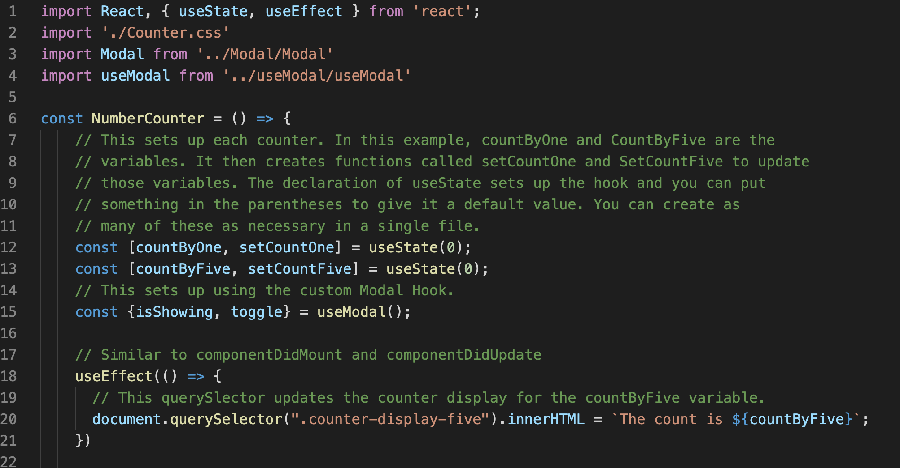

## Hooks Practice

### Description

I created this repo as a way to learn some basic use cases fo React Hooks. There is a good amount of comments in the code that explain's what is done. I will have these examples deployed at http://hookspractice.magicaltech.xyz.

### Installation

Just download the repo and checkout the code. There will be a number of comments throughout that will explain what is being done. You will need to install dependencies using `npm install`. You can then use `npm start` to see how the code runs.

Here are a list of hooks that are currently being demonstrated:

* useState
* useEffect
* custom Hooks

### Attributes
James King - https://upmostly.com/tutorials/modal-components-react-custom-hooks

React Documentation - https://reactjs.org/docs/hooks-intro.html

### Author

William Chrapcynski
